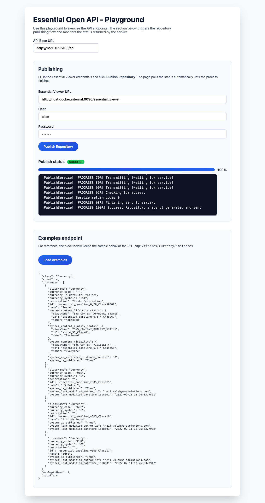

# essential-open-api
Essential Open API is a Python Flask API that provides dynamic access to classes, instances, and relationships from the Essential meta-model, compatible with Essential Utility API v3. It also enables repository publishing and real-time progress monitoring within Essential Open Source.

## Run with Docker

This project ships with a ready-to-use Docker setup. Follow the steps below to build and run the containerized API.

### Prerequisites

- [Docker](https://docs.docker.com/get-docker/)
- [Docker Compose](https://docs.docker.com/compose/) (v2 or newer)

### Build the image

```bash
docker compose build
```

The command uses the `Dockerfile` in the repository root to install dependencies and configure the Flask application.

### Run the services

```bash
docker compose up
```

This starts the Flask API on port `5100` (mapped from the container). The container mounts the project directory, so local code changes are reflected immediately.

### Useful commands

- **Stop services**

  ```bash
  docker compose down
  ```

- **Rebuild from scratch**

  ```bash
  docker compose build --no-cache
  ```

## Demo UI (HTML)

The `demo/` directory contains a static HTML page that interacts with the API and demonstrates key endpoints:

- Configure the API base URL in the header field.
- Trigger repository publishing and monitor real-time progress with a progress bar.
- Inspect the `/api/classes/Currency/instances` endpoint response.

To view the demo, open `demo/index.html` in a browser (or serve the folder via a simple static server). Ensure the API is running and accessible from the configured base URL.


